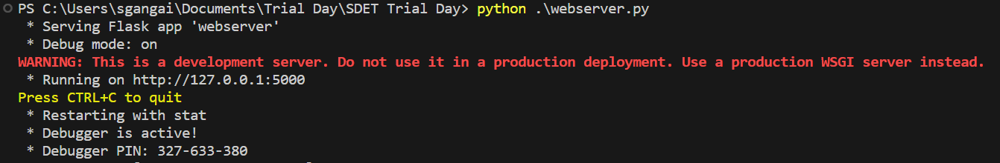

## Starting the server
Install the flask package in order to be able to run the webserver
```
pip install flask
```

Open a terminal and run the following command from the project directory (folder :WebPage)
```
python webserver.py
```
___
This will create a webserver listening on [http://127.0.0.1:5000](http:127.0.0.1:5000)


___
## Usage
* Once you navigate to the url click sign up and enter in your credentials.
* After sign up you can log in with those credentials.
* Logging in will display a list of registered users.
* The only action you have available is to delete users.

## Task
Used a Selenium Webdriver (Python) to automate the use cases below.

### User story 1:
`As an unregistered user, I would like to register as a new account.`
> **Acceptance criteria:**
> * A new user is registered and is stored in the database with the given credentials. 
> * Each new user will receive an _id_ which is unique to that user
><br/> 
<br/> 

### User story 2:

`As a registered user, I want to login to the system using the credentials that I registered with.`
>**Acceptance criteria:**
>*  A registered user is able to login with the registration credentials succesfully. 
> * Once logged in, the user list screen is displayed.
> <br/> 
<br/> 

### User story 3: 
`As a logged in user, I want to be able to delete other users from the system`
>___
>**Acceptance criteria:**
> * From the user list screen, clicking the delete button will delete a user from the list.
> * The list is auto updated and the user is no longer visible
> * The deleted user can no longer log in.
>___
><br/> 
___
## Test
> * Used pytest and markers for grouping and running specific tests.
> * Run all tests: 
        pytest main.py
> * Run only signup-related tests: 
        pytest -m signup main.py
> * Run a specific test function inside a marker: 
        pytest -m signup -k test_valid_registration main.py

